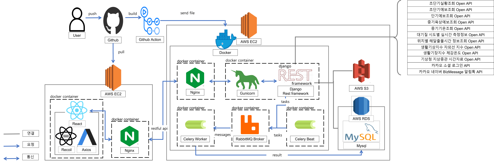
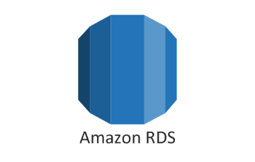

# dnd-7th-4-backend

## 👩🏻‍💻 Developer

|      | 이수진 [@ssssujini99](https://github.com/ssssujini99)  | 이채영 [@chea-young](https://github.com/chea-young)|
|------|------|---|

## 🗺 Architecture

## 🛠 Tech Stack

### ✔️ Infra

|Docker|Github Actions|
|:---:|:---:|
||

### ✔️ DataBase

| MySQL                                                        | RDS                                                     |S3|
|--------------------------------------------------------------|---------------------------------------------------------|---|
|  |  |

### ✔️ Web Server

| EC2                                                      | ELB                                                      | Django                                                         | Nginx                                                        |gunicorn|
|----------------------------------------------------------|----------------------------------------------------------|----------------------------------------------------------------|--------------------------------------------------------------|---|
|  |  |  |  |

